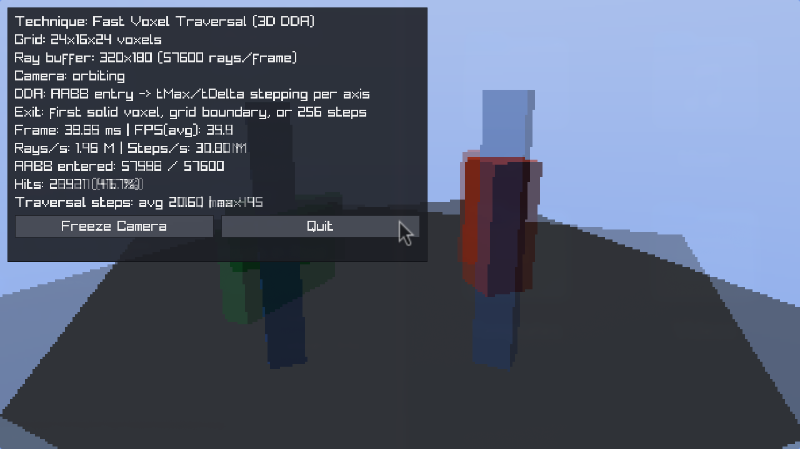

# Simple Amanatides-Woo 3D DDA CPU Based Algorithm

Simple example of using CPU to implement Fast Voxel 3D raytrace rendering using
Amanatides-Woo 3D DDA algorithm. Raylib is used to display the 
calculated texture representing the result.

This is mainly for learning purposes, hence the direct use of CPU instead of more complex and efficient GPU usage.

## Running

Project uses CMake, so the standard commands are available.

There are also `run.sh` and `run.bat` to quickly run the example code.

Inspired by: [This Tiny Algorithm Can Render BILLIONS of Voxels in Real Time (Youtube)](https://youtu.be/ztkh1r1ioZo?si=qDtCxnli8gqjLcM7)